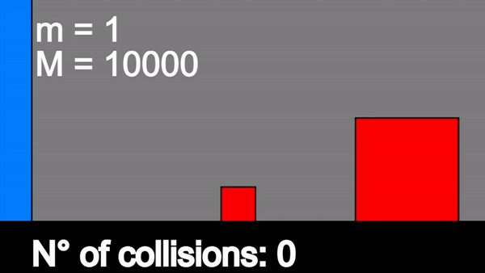

# Collision_PI

Estimate Pi from collisions.

Inspired by @3blue1brown: here is the YouTube [video](https://www.youtube.com/watch?v=HEfHFsfGXjs) with the explanation.

The result is quite good:

and here there is a short video:

